# PowerGSLB - DNS Global Server Load Balancing

[![CI][ci-badge]][ci-runs]
[![Latest release][release-badge]][releases]
[![Docker pulls][pulls-badge]][docker-hub]
[![mypy: checked][mypy-badge]][ci-config]
[![pylint: 10.00/10][pylint-badge]][ci-config]
[![coverage: 100%][coverage-badge]][ci-config]
[![Python 3.12+][python-badge]][pyproject]
[![License: MIT][license-badge]][license]

PowerGSLB is a DNS-based Global Server Load Balancing (GSLB) solution built as a PowerDNS Authoritative Server
[Remote Backend](https://doc.powerdns.com/authoritative/backends/remote.html). It continuously health-checks the
endpoints behind your DNS records and returns only the live ones, honoring weighted priorities, per-rrset routing
policies (round-robin, weighted-random, sticky-hash), and DNS views (CIDR and GeoIP).

## Table of Contents

* [Main features](#main-features)
* [Architecture](#architecture)
* [Quick start with the published Docker image](#quick-start-with-the-published-docker-image)
* [Persisting data](#persisting-data)
* [Upgrading](#upgrading)
* [Building the Docker image](#building-the-docker-image)
* [Manual setup](#manual-setup)
* [Configuration](#configuration)
* [Database](#database)
* [Web administration interface](#web-administration-interface)
* [Record selection](#record-selection)
    * [Views](#views)
    * [EDNS Client Subnet (ECS)](#edns-client-subnet-ecs)
    * [Weight (priority)](#weight-priority)
    * [Routing policies](#routing-policies)
    * [Disabled records](#disabled-records)
* [Health checks](#health-checks)
    * [General parameters](#general-parameters)
    * [Exec parameters](#exec-parameters)
    * [ICMP parameters](#icmp-parameters)
    * [HTTP parameters](#http-parameters)
    * [TCP parameters](#tcp-parameters)
    * [TLS parameters](#tls-parameters)
    * [Trust custom CA certificates](#trust-custom-ca-certificates)
* [Traffic management patterns](#traffic-management-patterns)
* [Performance](#performance)
    * [DNS query path](#dns-query-path)
    * [PowerDNS caching](#powerdns-caching)
    * [Response compression](#response-compression)
    * [Admin grid paging](#admin-grid-paging)
* [API](#api)
* [Tests](#tests)
* [License](#license)

---

## Main features

* Written in Python 3.12
* Built as PowerDNS Authoritative Server [Remote Backend](https://doc.powerdns.com/authoritative/backends/remote.html)
* Modular and multithreaded architecture
* Systemd status and watchdog support
* Quick installation and setup
* All-in-one Docker image
* DNS GSLB configuration stored in a MySQL / MariaDB database
* Master-Slave DNS GSLB using native MySQL / MariaDB [replication](https://mariadb.com/kb/en/standard-replication/)
* Multi-Master DNS GSLB using native MySQL / MariaDB [Galera Cluster](https://galeracluster.com/)
* Web-based administration interface using [w2ui](https://github.com/vitmalina/w2ui)
* JSON [HTTP API](#api) for DNS queries and CRUD administration
* HTTPS support for the web server
* Record selection:
    * DNS GSLB views (CIDR and GeoIP)
    * EDNS Client Subnet (ECS) support
    * Weighted (priority) records
    * Per-rrset routing policies: round-robin, weighted-random, sticky-hash
    * "All down = all up" so DNS never fails entirely during a full outage
* Extendable health checks:
    * Arbitrary command execution
    * ICMP ping
    * HTTP request
    * TCP connect
    * TLS connect

---

## Architecture

PowerGSLB runs a fixed set of cooperating service threads under a systemd-aware supervisor:

* **Monitor** - periodically reads the health-check configuration from the database, runs one check thread per
  monitored record, and maintains the in-memory set of records that are currently down. Rise / fall counters debounce
  flapping endpoints.
* **DNS interface** (default `127.0.0.1:8080`, plain HTTP) - implements the PowerDNS Remote Backend protocol. PowerDNS
  forwards each query here; PowerGSLB filters the candidate records by query type, view, and health status, then the
  rrset's routing policy chooses the answers (reading each record's weight), and returns a JSON DNS response.
* **Admin interface** (default `0.0.0.0:443`, HTTPS) - the web management UI and its CRUD API. Authenticates via HTTP
  Basic Auth against the database (crypt(3) SHA-512 hashes, verified in constant time).

The two HTTP surfaces are served by separate handler classes on separate ports, so the admin API is never reachable on
the DNS port and vice versa. The supervisor integrates with systemd (`READY=1`, watchdog, `STOPPING=1`) and shuts the
threads down cooperatively on `SIGTERM` / `SIGINT`.

### Class diagram

<details>
<summary>Click to expand the class diagram</summary>

The diagram below maps the application classes and their relationships. Standard-library and third-party base classes
are marked `<<stdlib>>` / `<<builtin>>`; the two helper modules that hold free functions are shown as `<<module>>`
pseudo-classes.

```mermaid
classDiagram
    direction TB

    %% ===== Entry point =====
    class PowerGSLB {
        +main()$ None
    }

    %% ===== system =====
    class Config {
        -dict _data
        +get(section, option, default) Any
        +items(section) dict
    }
    class _Section {
        -Config _config
        -str _section
        +get(option, default) Any
        +pop(option, default) Any
    }
    class SystemService {
        +Sequence~ServiceThread~ service_threads
        +float sleep_interval
        +float shutdown_timeout
        +start() None
        +systemd_notify(status, unset)$ None
        +watchdog_interval(default)$ float
    }
    class ServiceThread {
        <<Protocol>>
        +str name
        +start() None
        +is_alive() bool
        +shutdown(timeout) None
    }
    class password {
        <<module>>
        +hash_password(password)$ str
        +verify_password(password, stored)$ bool
    }

    %% ===== client =====
    class ClientGeo {
        +str | None country
        +str | None continent
    }
    class ClientContext {
        +IPAddress ip
        +int prefixlen
        +ClientGeo | None geo
    }

    %% ===== view =====
    class GeoIPReader {
        +frozenset~str~ CONTINENT_CODES$
        +frozenset~str~ COUNTRY_CODES$
        -Reader _reader
        +parse_geo_token(token)$ tuple | None
        +lookup(ip) ClientGeo
    }
    class ViewRule {
        -GeoIPReader | None _geoip$
        +tuple~IPNetwork~ cidrs
        +tuple~tuple~ geos
        +bool matches_all
        +configure(geoip_config)$ None
        +resolve(rule)$ ViewRule
        +matches(context) bool
    }

    %% ===== monitor =====
    class AbstractThread {
        <<abstract>>
        +float sleep_interval
        +run() None
        +shutdown(timeout) None
        +task()* None
    }
    class MonitorManager {
        -dict~int,CheckThread~ _threads
        -StatusRegistry _status_registry
        +build_check(check)$ Check
        +task() None
        +shutdown(timeout) None
    }
    class StatusRegistry {
        -set~int~ _status
        +add(id) None
        +remove(id) None
        +is_down(id) bool
        +snapshot() list
        +get_writer(id) StatusWriter
        +retain(valid_ids) set
    }
    class StatusWriter {
        -StatusRegistry _registry
        +int content_id
        +set_down() None
        +set_up() None
        +is_down() bool
    }
    class CheckThread {
        +Check check
        +StatusWriter status_writer
        +content_id() int
        +task() None
    }

    %% ===== monitor/check =====
    class Check {
        <<abstract dataclass>>
        -dict _registry$
        +str name$
        +bool skip$
        +int interval
        +int timeout
        +int fall
        +int rise
        +create(spec)$ Check
        +configure(options)$ None
        +execute()* bool
    }
    class NoCheck {
        +name = "none"
        +skip = True
        +execute() bool
    }
    class IcmpCheck {
        +name = "icmp"
        +bool privileged$
        +str ip
        +execute() bool
    }
    class TcpCheck {
        +name = "tcp"
        +str ip
        +int port
        +execute() bool
    }
    class TlsCheck {
        +name = "tls"
        +str ip
        +int port
        +bool tls_verify
        +str host
        +execute() bool
    }
    class HttpCheck {
        +name = "http"
        +str url
        +str method
        +str expected_status
        +str body_match
        +bool tls_verify
        +str host
        +execute() bool
    }
    class ExecCheck {
        +name = "exec"
        +list~str~ args
        +int expected_code
        +str output_match
        +bool redirect_error
        +execute() bool
    }

    %% ===== routing =====
    class RoutingPolicy {
        <<abstract dataclass>>
        +str name$
        +create(spec)$ RoutingPolicy
        +resolve(policy_json)$ RoutingPolicy
        +network_prefix(context) int | None
        +select(candidates, context)* list
    }
    class RoundRobin {
        +name = "round-robin"
        +int max_answers
        +select(candidates, context) list
    }
    class WeightedRandom {
        +name = "weighted-random"
        +int max_answers
        +select(candidates, context) list
    }
    class StickyHash {
        +name = "sticky-hash"
        +int max_answers
        +int ipv4_prefix
        +int ipv6_prefix
        +network_prefix(context) int | None
        +select(candidates, context) list
    }

    %% ===== server/http =====
    class HTTPServerManager {
        +str address
        +int port
        +bool ssl
        +str root
        +float keep_alive_timeout
        -type~HTTPRequestHandler~ _handler
        +run() None
        +shutdown(timeout) None
    }
    class _ThreadingHTTPServer {
    }
    class HTTPRequestHandler {
        <<abstract>>
        +str route$
        +Database database
        +StatusRegistry status_registry
        +bytes body
        +handle() None
        +do_GET() None
        +do_HEAD() None
        +do_POST() None
        +_handle_route()* None
    }
    class PowerDNSRequestHandler {
        +route = "dns"
        +content() str
    }
    class AdminRequestHandler {
        +route = "admin"
        -dict _commands$
        +send_head() BytesIO | BinaryIO | None
        +content() str
    }
    class queryparser {
        <<module>>
        +parse_query(query_string)$ dict
    }
    class QueryParserError {
        <<Exception>>
    }

    %% ===== database =====
    class MySQLDatabase {
        +Error
        +join_operation(op)$ str
        +select(op, params) list
        +modify(op, params) int
        +execute_transaction(stmts) int
        +__enter__() Self
        +__exit__() None
    }
    class PowerDNSMixIn {
        <<abstract>>
        +zone_suffixes(qname)$ list
        +gslb_checks() list
        +gslb_domains(include_disabled) list
        +gslb_records(qname, qtype) list
    }
    class W2UIMixIn {
        <<abstract>>
        +check_user(user, password) list
        +get_data(data, recid, page, ...) tuple
        +save_data(data, save_recid, ...) int
        +delete_data(data, ids) int
    }
    class PageRequest {
        <<dataclass>>
        +tuple searches
        +bool or_logic
        +tuple sorts
        +int | None limit
        +int | None offset
        +from_query(query)$ PageRequest
    }
    class Selector {
        <<Protocol>>
        +select(op, params) list
    }
    class Executor {
        <<Protocol>>
        +modify(op, params) int
        +execute_transaction(stmts) int
    }
    class Table {
        <<dataclass>>
        +str name
        +str key
        +tuple fields
        +tuple columns
        +Mapping aliases
        +Mapping defaults
        +get(db, recid, page, ...) tuple
        +save(db, save_recid, ...) int
        +remove(db, ids) int
    }
    class Records {
        +get(db, recid, page, ...) tuple
        +save(db, save_recid, ...) int
    }
    class Users {
        -str _mask$
        +check_user(db, user, password) list
        +save(db, save_recid, ...) int
    }
    class Status {
        +save(db, save_recid, ...) int
        +remove(db, ids) int
    }

    %% ===== stdlib bases =====
    class Thread { <<stdlib>> }
    class SimpleHTTPRequestHandler { <<stdlib>> }
    class HTTPServer { <<stdlib>> }
    class ThreadingMixIn { <<stdlib>> }
    class MySQLConnection { <<mysql.connector>> }
    class dict { <<builtin>> }

    %% ===== Inheritance =====
    dict <|-- _Section
    Thread <|-- AbstractThread
    AbstractThread <|-- MonitorManager
    AbstractThread <|-- CheckThread
    Check <|-- NoCheck
    Check <|-- IcmpCheck
    Check <|-- TcpCheck
    Check <|-- TlsCheck
    Check <|-- HttpCheck
    Check <|-- ExecCheck
    RoutingPolicy <|-- RoundRobin
    RoutingPolicy <|-- WeightedRandom
    RoutingPolicy <|-- StickyHash
    Thread <|-- HTTPServerManager
    ThreadingMixIn <|-- _ThreadingHTTPServer
    HTTPServer <|-- _ThreadingHTTPServer
    SimpleHTTPRequestHandler <|-- HTTPRequestHandler
    HTTPRequestHandler <|-- PowerDNSRequestHandler
    HTTPRequestHandler <|-- AdminRequestHandler
    PowerDNSMixIn <|-- MySQLDatabase
    W2UIMixIn <|-- MySQLDatabase
    Selector <|-- Executor
    Table <|-- Records
    Table <|-- Users
    Records <|-- Status
    ServiceThread <|.. MonitorManager : satisfies
    ServiceThread <|.. HTTPServerManager : satisfies
    Executor <|.. MySQLDatabase : satisfies

    %% ===== Associations / composition =====
    PowerGSLB ..> Config : creates
    PowerGSLB ..> StatusRegistry : creates
    PowerGSLB ..> ViewRule : configure
    PowerGSLB ..> MonitorManager : creates
    PowerGSLB ..> HTTPServerManager : creates
    PowerGSLB ..> SystemService : creates
    Config ..> _Section : builds
    SystemService o--> "*" ServiceThread : supervises
    MonitorManager o--> "*" CheckThread : manages
    MonitorManager --> StatusRegistry
    MonitorManager ..> Check : create
    CheckThread --> Check
    CheckThread --> StatusWriter
    StatusRegistry ..> StatusWriter : creates
    StatusWriter --> StatusRegistry
    HTTPServerManager o--> _ThreadingHTTPServer : owns
    HTTPServerManager --> StatusRegistry
    HTTPServerManager ..> HTTPRequestHandler : instantiates per request
    HTTPRequestHandler --> MySQLDatabase : per-connection
    MySQLDatabase o--> MySQLConnection : holds
    HTTPRequestHandler --> StatusRegistry
    AdminRequestHandler ..> MonitorManager : build_check (validate)
    AdminRequestHandler ..> RoutingPolicy : resolve (validate)
    AdminRequestHandler ..> ViewRule : resolve (validate)
    AdminRequestHandler ..> queryparser : parse_query
    AdminRequestHandler ..> PageRequest : builds
    queryparser ..> QueryParserError : raises
    W2UIMixIn ..> Table : routes by token
    Table ..> Executor : executes through
    Table ..> PageRequest : reads
    Users ..> password : hash / verify
    PowerDNSRequestHandler ..> RoutingPolicy : resolve
    PowerDNSRequestHandler ..> ViewRule : resolve
    PowerDNSRequestHandler ..> ClientContext : builds
    ViewRule o--> GeoIPReader : classvar
    ViewRule ..> ClientContext : reads / fills
    GeoIPReader ..> ClientGeo : returns
    RoutingPolicy ..> ClientContext : reads
```



</details>

---

## Quick start with the published Docker image

The fastest way to try PowerGSLB is the all-in-one image, which bundles PowerGSLB, PowerDNS Authoritative Server,
MariaDB, and systemd on a single RHEL UBI 10 base.

The run below is volume-less and disposable: each `docker run` starts from a clean, freshly-initialized database, and
removing the container discards everything. That is the right mode for a demo and tests. For any data that must outlive
the container, see [Persisting data](#persisting-data) below.

```shell
docker pull docker.io/acudovs/powergslb:2.3.2

docker run -it --privileged \
    --name powergslb --hostname powergslb \
    --tmpfs /run --tmpfs /tmp \
    docker.io/acudovs/powergslb:2.3.2
```

Find the container IP address and use it to reach the services:

```shell
CONTAINER_IP=$(docker inspect -f '{{range .NetworkSettings.Networks}}{{.IPAddress}}{{end}}' powergslb)
```

Smoke-test DNS once the container is up:

```shell
dig @${CONTAINER_IP} example.com SOA
dig @${CONTAINER_IP} example.com A
dig @${CONTAINER_IP} example.com AAAA
dig @${CONTAINER_IP} example.com ANY
```

Then open the admin interface at `https://${CONTAINER_IP}/admin/`. Each container generates its own self-signed
certificate on first start, so the browser shows a security warning; proceed past it to reach the UI.

* Default username: `admin`
* Default password: `admin`

Change the default password after first login. Edit the `admin` user in the admin UI under the "Users" section.

Manage and stop the container:

```shell
docker exec -it powergslb bash
docker stop powergslb
```

To reach the services on the host instead of the container IP, publish the ports with
`-p 53:53/tcp -p 53:53/udp -p 443:443/tcp`. Note that these may conflict with a DNS resolver or HTTPS service already
listening on the host, so connecting to the container IP is usually simpler.

---

## Persisting data

The image ships an empty datadir and initializes the database on first start, so without a volume every run begins from
scratch. Any deployment whose data must outlive the container must mount a **named** volume at `/var/lib/mysql`:

```shell
docker volume create powergslb-db

docker run -it --privileged \
    --name powergslb --hostname powergslb \
    --tmpfs /run --tmpfs /tmp \
    -v powergslb-db:/var/lib/mysql \
    docker.io/acudovs/powergslb:2.3.2
```

First boot initializes the database inside the volume; later runs detect the existing data and reuse it untouched. A
bind mount (`-v "$PWD/db:/var/lib/mysql"`) or a Kubernetes PVC works the same way.

---

## Upgrading

Upgrading between PowerGSLB versions is a container swap; the volume is the only state carried across. Stop and remove
the old container, pull (or rebuild) the new image, and run it with the **same** named volume:

```shell
docker stop powergslb && docker rm powergslb
docker pull docker.io/acudovs/powergslb:"$NEW_VERSION"

docker run -it --privileged \
    --name powergslb --hostname powergslb \
    --tmpfs /run --tmpfs /tmp \
    -v powergslb-db:/var/lib/mysql \
    docker.io/acudovs/powergslb:"$NEW_VERSION"
```

---

## Building the Docker image

Build the image from a checkout of the repository instead of pulling it:

```shell
VERSION=$(PYTHONPATH=src python3 -c "from powergslb.version import VERSION; print(VERSION)")

docker build -f docker/Dockerfile --force-rm --no-cache -t powergslb:"$VERSION" .

docker run -it --privileged --name powergslb --hostname powergslb \
    --tmpfs /run --tmpfs /tmp \
    powergslb:"$VERSION"
```

---

## Manual setup

The Docker image is the recommended way to run PowerGSLB. To install the Python package directly - for development, or
to integrate with an existing PowerDNS and MariaDB - build the package and install it into a virtual environment.

Create a virtual environment (activation is required each time before use):

```shell
python3 -m venv --copies --system-site-packages --upgrade-deps .venv
source .venv/bin/activate
```

Install dev dependencies and the project in editable mode, then build the sdist and wheel:

```shell
pip install --group dev --editable .
python -m build
```

Install the built wheel:

```shell
pip install --force-reinstall --upgrade dist/powergslb-*-py3-none-any.whl
```

Run the service against a configuration file (`-c` / `--config` is required):

```shell
powergslb -c /etc/powergslb/powergslb.toml
```

The service also needs a MariaDB database with the schema and seed data loaded (`database/scheme.sql` and
`database/data.sql`), and a PowerDNS Remote Backend pointed at the DNS interface. See the files under `docker/rootfs/`
for reference configuration (`powergslb.toml` and `pdns.conf.powergslb`).

---

## Configuration

PowerGSLB is configured from a single TOML file, passed with `-c` / `--config`. The default file ships at
[docker/rootfs/etc/powergslb/powergslb.toml](docker/rootfs/etc/powergslb/powergslb.toml) and is deployed to
`/etc/powergslb/powergslb.toml` in the Docker image. Values are natively typed: ports and timeouts are integers, `ssl`
is a boolean, and the rest are strings.

| section      | purpose                         | key options                                                   |
|--------------|---------------------------------|---------------------------------------------------------------|
| `[logging]`  | Python logging                  | `format`, `level`                                             |
| `[database]` | MySQL / MariaDB connection      | `database`, `user`, `password`, `host`, `port`, `unix_socket` |
| `[server]`   | DNS interface (Remote Backend)  | `address`, `port`, TLS options, `keep_alive_timeout`          |
| `[admin]`    | admin interface (web UI + API)  | `address`, `port`, TLS options, `keep_alive_timeout`, `root`  |
| `[monitor]`  | health-check engine             | `update_interval` (seconds), per-check-type knobs             |
| `[geoip]`    | geo routing for [views](#views) | `database` (path to a GeoIP database)                         |

The `[database]` is passed straight to `mysql.connector` as connect kwargs. When `unix_socket` is set it takes
precedence over `host` / `port`.

`[server]` and `[admin]` are served by the same HTTP engine, so they accept the same options. Both take
`keep_alive_timeout` (the HTTP keep-alive idle timeout in seconds) and the same TLS set: `ssl` (bool) to enable HTTPS,
`cert` (a PEM that may also bundle the private key), `key` (a separate key file when `cert` holds only the
certificate), and `ciphers` (an OpenSSL cipher string).

The `[admin]` certificate is self-signed, generated once on first container start (the `powergslb-certgen` oneshot
unit writes `/etc/powergslb/powergslb.pem` only if it is missing) so each deployment gets its own unique cert. Replace
`cert` with your own PEM for production.

The bundled PowerDNS reaches the `[server]` DNS interface over loopback, so it ships as plain HTTP. To secure that hop
for an external PowerDNS instance, enable TLS on `[server]` the same way as on `[admin]` - just set `ssl = true` and
point `cert` (and `key`) at a certificate - then switch the Remote Backend URL to `https://`.

The `[monitor]` section tunes the health-check engine as a whole. `update_interval` is how often it re-reads the
monitor configuration from the database; the remaining keys are `<type>_<option>` defaults applied to every check of
that type (unlike the per-monitor JSON in [Health checks](#health-checks), these are process-global):

| option              | type | default               | effect                                                               |
|---------------------|------|-----------------------|----------------------------------------------------------------------|
| `update_interval`   | int  | `60`                  | Seconds between database re-reads of the monitor configuration.      |
| `exec_output_chunk` | int  | `65536`               | Bytes of command output searched by a check's `output_match`.        |
| `http_body_chunk`   | int  | `65536`               | Bytes of the HTTP body read and searched by a check's `body_match`.  |
| `http_user_agent`   | str  | `PowerGSLB/<version>` | `User-Agent` header every HTTP check sends.                          |
| `icmp_privileged`   | bool | `true`                | Raw ICMP socket (`CAP_NET_RAW`) vs. an unprivileged datagram socket. |

The `[geoip]` section `database` is the path to a MaxMind DB (MMDB) file. The Docker image bundles the
[DB-IP IP-to-Country Lite](https://db-ip.com/db/download/ip-to-country-lite) at
`/usr/share/powergslb/dbip-country-lite.mmdb`; point `database` at a
[MaxMind GeoLite2 / GeoIP2](https://www.maxmind.com/) file to swap it.

### Environment overrides

Every option can be overridden by an environment variable named `POWERGSLB_<SECTION>_<OPTION>` (uppercased), coerced to
the configured value's type. This is how the Docker image is tuned without editing the file; the systemd unit
allow-lists these via `PassEnvironment`.

<details>
<summary>Click to expand example values</summary>

```shell
# [logging]
POWERGSLB_LOGGING_FORMAT="%(levelname)s %(message)s"  # Python logging format string
POWERGSLB_LOGGING_LEVEL=INFO

# [database]
POWERGSLB_DATABASE_DATABASE=powergslb
POWERGSLB_DATABASE_USER=powergslb
POWERGSLB_DATABASE_PASSWORD=secret
POWERGSLB_DATABASE_HOST=192.168.1.20                  # connect to a remote database
POWERGSLB_DATABASE_PORT=3306
POWERGSLB_DATABASE_UNIX_SOCKET=                       # empty: use host/port over TCP instead of the socket
POWERGSLB_DATABASE_CONNECTION_TIMEOUT=1

# [server]
POWERGSLB_SERVER_ADDRESS=0.0.0.0                      # expose the DNS backend beyond loopback
POWERGSLB_SERVER_PORT=8080
POWERGSLB_SERVER_SSL=false
POWERGSLB_SERVER_CERT=
POWERGSLB_SERVER_KEY=
POWERGSLB_SERVER_CIPHERS=
POWERGSLB_SERVER_KEEP_ALIVE_TIMEOUT=300

# [admin]
POWERGSLB_ADMIN_ADDRESS=0.0.0.0
POWERGSLB_ADMIN_PORT=8443
POWERGSLB_ADMIN_SSL=true
POWERGSLB_ADMIN_CERT=/etc/powergslb/powergslb.pem
POWERGSLB_ADMIN_KEY=                                  # separate key file when cert holds only the certificate
POWERGSLB_ADMIN_CIPHERS=ECDHE-RSA-AES256-GCM-SHA384
POWERGSLB_ADMIN_KEEP_ALIVE_TIMEOUT=300
POWERGSLB_ADMIN_ROOT=/tmp/powergslb                   # override the admin UI document root

# [monitor]
POWERGSLB_MONITOR_UPDATE_INTERVAL=2                   # pick up monitor changes faster (handy for testing)
POWERGSLB_MONITOR_ICMP_PRIVILEGED=false               # use an unprivileged ICMP datagram socket
POWERGSLB_MONITOR_HTTP_BODY_CHUNK=65536
POWERGSLB_MONITOR_HTTP_USER_AGENT=PowerGSLB-probe     # override the HTTP check User-Agent
POWERGSLB_MONITOR_EXEC_OUTPUT_CHUNK=65536

# [geoip]
POWERGSLB_GEOIP_DATABASE=/data/GeoLite2-Country.mmdb  # use a MaxMind file instead of the bundled DB-IP Lite
```

</details>

---

## Database

The DNS GSLB configuration lives in a MySQL 8 / MariaDB 10.5+ database. The schema uses a two-level model: an *rrset*
is one `(domain, name, type)` and owns its `ttl` and `routing` policy; a *record* is one answer inside it (`content`
plus the `monitor`, `view`, `weight` and `disabled` flag). Record names are stored relative to the zone (`@` for the
apex, otherwise the labels left of the domain), so in the admin grid the `Domain` column is authoritative and `Name`
is relative.

DNS invariants (CNAME exclusivity, SOA cardinality, rrset garbage collection) are enforced in the database itself via
CHECK constraints and triggers, so both the web UI and handwritten SQL are covered.

The schema, seed data, entity-relationship diagram, table reference, and the rationale behind the design are documented
in [database/README.md](database/README.md).

---

## Web administration interface

The console offers a light and a dark theme.

**Status**


**Status (Dark theme)**


**Advanced search**


**Add new record**


**Monitors**


**Views**


[More images](images)

---

## Record selection

For each query PowerGSLB starts from every enabled record at the requested `(name, type)` and runs a pipeline before
answering: the **view** filter (client match), then the **health** filter (drop down records), then the rrset's
**[routing policy](#routing-policies)**, which reads each record's `weight` and chooses the answers. The client IP used
for the view filter and for sticky routing is read from the `X-Remotebackend-Real-Remote` header PowerDNS sends (the
real resolver address, or the client subnet when [ECS](#edns-client-subnet-ecs) is in play), not the PowerDNS host.

If the view filter leaves no candidate for a query type, that type is answered with nothing. A match-all view (the
seed `Public`, `0.0.0.0/0 ::/0`) is a **catch-all**: its records serve only when no narrower (specific) view matched
the client or every matched specific-view record is down. The health filter picks the first non-empty tier of live
specific-view records, live catch-all records, down specific-view records, down catch-all records - the down tiers
are the "all down = all up" rule, so a name never goes empty during a full outage; the policy then picks among them
as a last resort. Weights never cross a tier boundary: a high-weight `Public` record cannot outrank an in-view
specific record.

### Views

A view maps clients to records, so one name can resolve differently per client. Each view holds a space-separated
`rule`, and a record references exactly one view; a record is a candidate only when the client matches the rule. A
view whose rule matches every client (a prefixlen-0 CIDR in both families) is a catch-all: its records serve only
clients no specific view matched, per the precedence in [Record selection](#record-selection). The seed data ships a
`Public` view (`0.0.0.0/0 ::/0`, the catch-all), a `Private` view (the RFC 1918 ranges), and a geo `Europe` view
(`country:DE country:FR continent:EU`).

A rule is a space-separated list or CIDR and geo tokens - the client matches when it satisfies any one of them:

* **CIDR** (IPv4 or IPv6): `10.0.0.0/8`, `2001:db8::/32` - matches when the client IP falls inside the range.
* `country:<ISO>` - a two-letter [ISO 3166-1 alpha-2](https://en.wikipedia.org/wiki/ISO_3166-1_alpha-2) country
  code, e.g. `country:DE`.
* `continent:<CODE>` - a two-letter continent code (`AF`, `AN`, `AS`, `EU`, `NA`, `OC`, `SA`), e.g. `continent:EU`.

Geo tokens are case-insensitive and may be mixed freely with CIDRs, e.g. `10.0.0.0/8 country:DE continent:EU`. The
client's country and continent are resolved from the [`[geoip]`](#configuration) database at most once per query, and
only when the CIDR tokens miss (the CIDR check short-circuits first). Each view rule is compiled once into a cached
object and reused, so repeated lookups do no re-parsing. When no database is loaded the geo tokens never match.

### EDNS Client Subnet (ECS)

[ECS (RFC 7871)](https://datatracker.ietf.org/doc/html/rfc7871) changes *which client* record selection sees and
returns the matching **scope** so DNS caches keep per-subnet answers apart. Public resolvers (8.8.8.8, 1.1.1.1, ...)
often sit far from the end user; with ECS the resolver passes a truncated client subnet, so the view and routing policy
stages track the user instead of the resolver. The shipped `pdns.conf` enables `edns-subnet-processing`, which
forwards the client subnet to PowerGSLB as `X-Remotebackend-Real-Remote` - no extra configuration.

The scope returned per name and query type:

* Every record in a view that matches all clients (the seed `Public` view, `0.0.0.0/0 ::/0`) under a
  client-independent policy: scope `0`, globally cacheable.
* Any record in a narrower CIDR or geo view: scope = the resolver's source prefix - even for a public client that
  matched only the `Public` record, so one subnet's answer is never cached for another.
* [`sticky-hash`](#routing-policies) routing policy keys on the client network: scope = the policy's prefix, capped
  at the source prefix.
* `SOA`, `NS` and `DS`: always scope `0`, for a consistent view of delegation.
* No ECS option in the query: no ECS option in the response. An opt-out (source prefix `0`): scope `0`, answered
  from the match-all views.

If every record at a name for a query type sits in a narrower (non-`Public`) view, an out-of-view client gets an
empty (NODATA) answer that an ECS-aware resolver may cache globally at scope `0`, hiding the records from in-view
clients. Give such a name a `Public` fallback record so it never goes empty by subnet.

### Weight (priority)

Every routing policy reads the single per-record `weight`, but interprets it per its own rules (see
[Routing policies](#routing-policies)). Under the default `round-robin` and under `sticky-hash`, `weight` is a
**tier**: only the **highest-weight group** of live records is answered; equal-weight records all serve and load-share,
while lower-weight records stay on standby until every higher-weight record at the name is down. Under
`weighted-random`, `weight` is a **proportion** of the traffic instead. See
[Traffic management patterns](#traffic-management-patterns) for how the tiers and proportions map to concrete rollouts.

### Routing policies

A routing policy is a named, reusable, JSON-configured object that an rrset references (like a monitor). It decides
*which* records to answer from the live, in-view candidates - never their order, since PowerDNS and recursors re-sort
RRsets. The seed data ships one of each type; manage them in the "Routings" sidebar section. Every rrset
references exactly one policy.

| policy            | weight | returns                                           | parameters (default)                                         |
|-------------------|--------|---------------------------------------------------|--------------------------------------------------------------|
| `round-robin`     | tier   | up to `max_answers` from the highest tier         | `max_answers` (`8`)                                          |
| `weighted-random` | weight | up to `max_answers` by weighted random            | `max_answers` (`1`)                                          |
| `sticky-hash`     | tier   | up to `max_answers` from the highest tier, sticky | `max_answers` (`1`), `ipv4_prefix`/`ipv6_prefix` (`24`/`64`) |

* **round-robin** (default) answers the highest-weight live tier. A tier of `max_answers` or fewer is returned whole;
  a larger tier is randomly subsampled to `max_answers` to bound UDP fragmentation / `TC=1` truncation. Example:
  `{"type": "round-robin"}` or `{"type": "round-robin", "max_answers": 4}`.
* **weighted-random** answers up to `max_answers` records (default `1`), sampled weighted-random by `weight` without
  replacement over all live records. With the default single answer each query picks one record by weight, so the
  proportional split is exact across queries; `max_answers` above 1 returns several weighted records per answer that
  resolvers may reorder, so the split then holds only statistically. An all-zero-weight set samples evenly. Example:
  `{"type": "weighted-random"}` or `{"type": "weighted-random", "max_answers": 3}`.
* **sticky-hash** answers up to `max_answers` records (default `1`) from the highest live tier, pinned per client
  network via rendezvous (HRW) hashing: the client is masked to `ipv4_prefix` / `ipv6_prefix` and records are ranked by
  a salt-free hash of `(network, content)`, returning the top `max_answers`, so a health flap or record change remaps
  only ~`max_answers`/N clients (~1/N at the default `max_answers`). Stickiness is stable per client network **given
  the same live set and prefixes**. Example:
  `{"type": "sticky-hash"}` or `{"type": "sticky-hash", "max_answers": 2, "ipv4_prefix": 16}`.

Liveness is decided by the [health checks](#health-checks) below, and candidates follow the view precedence in
[Record selection](#record-selection): a live catch-all (`Public`) record takes over when every matched specific-view
record is down. When every in-view record is down, the down records are reactivated ("all down = all up") so the name
still resolves; `round-robin` / `sticky-hash` then serve the highest-weight tier as a last resort, and
`weighted-random` falls back to its split.

### Disabled records

A record can be administratively disabled in the admin UI. A disabled record is excluded from every DNS answer
regardless of health, view, or weight - handy for draining an endpoint for maintenance without deleting its
configuration.

---

## Health checks

Health checks are configured in the "Monitors" sidebar section in JSON format.

Supported check types:

| type | description                 |
|------|-----------------------------|
| none | no check (always healthy)   |
| exec | arbitrary command execution |
| icmp | ICMP ping                   |
| http | HTTP request                |
| tcp  | TCP connect                 |
| tls  | TLS connect                 |

### General parameters

Parameters shared by all check types. Only `type` is required; the timing parameters are optional and fall back to
their defaults, so a monitor JSON may omit them.

| parameter | description                                  | default |
|-----------|----------------------------------------------|---------|
| type      | check type                                   |         |
| interval  | seconds between checks                       | `3`     |
| timeout   | per-run check timeout in seconds             | `1`     |
| fall      | number of failed checks to disable record    | `3`     |
| rise      | number of successful checks to enable record | `5`     |

The `none` type takes no parameters (`{"type": "none"}`); it is the "No check" monitor and is never run.

The token `${content}` in any string value is replaced with the record's content (typically its IP address), so one
monitor can serve many records. Every other character - including `%`, `$`, `{` and `}` - is treated literally and
needs no escaping.

A check does not have to target the record's own content. Because the target is whatever you put in the monitor JSON,
you can omit `${content}` and hard-code any IP, URL, or command, so a record's liveness is gated on a separate endpoint
or a script. This is useful when a record should serve only while some dependency is reachable - an origin behind a CDN
record, an upstream gateway, a database, or any external API:

```json
{"type": "http", "url": "https://origin.example.com/health"}
```

### Exec parameters

| parameter      | description                                                        | default |
|----------------|--------------------------------------------------------------------|---------|
| type           | exec                                                               |         |
| args           | command to execute and arguments                                   |         |
| expected_code  | exit code that counts as healthy                                   | `0`     |
| output_match   | regex against the first 64 KiB of output; `""` skips the scan      | `""`    |
| redirect_error | merge the command's stderr into stdout so `output_match` sees both | `true`  |

Example:

```json
{"type": "exec", "args": ["/etc/powergslb/powergslb-check", "${content}"]}
```

The whole run is bounded by `timeout`; on timeout the process is killed and the check fails. Only the first
`exec_output_chunk` bytes (a `[monitor]` [config](#configuration) knob, default 64 KiB) are kept for `output_match`;
any excess is drained so a chatty command can still exit.

### ICMP parameters

| parameter | description         |
|-----------|---------------------|
| type      | icmp                |
| ip        | endpoint IP address |

Example:

```json
{"type": "icmp", "ip": "${content}"}
```

ICMP checks open a raw ICMP socket and therefore need `CAP_NET_RAW` or root. The shipped container satisfies this:
the service runs as root and `powergslb.service` keeps `CAP_NET_RAW` in `CapabilityBoundingSet`. To run unprivileged,
set `icmp_privileged = false` in the `[monitor]` config section: this uses an ICMP datagram socket, but only works when
the service's GID is inside the kernel `net.ipv4.ping_group_range` range:

```bash
sysctl -w net.ipv4.ping_group_range="0 2147483647"
```

### HTTP parameters

| parameter       | description                                                              | default     |
|-----------------|--------------------------------------------------------------------------|-------------|
| type            | http                                                                     |             |
| url             | endpoint URL                                                             |             |
| method          | request method, `GET` or `HEAD`                                          | `GET`       |
| expected_status | comma-separated codes and inclusive ranges, e.g. `"101,200-204,300-308"` | `"200-399"` |
| body_match      | regex against the first 64 KiB of body; `GET` only; `""` skips the scan  | `""`        |
| tls_verify      | verify the server TLS certificate                                        | `true`      |
| host            | override the HTTP `Host` header; TCP destination unchanged; `""` off     | `""`        |

Redirects are never followed: a `3xx` is evaluated on its own status (accepted by the default success range). Only the
first `http_body_chunk` bytes (a `[monitor]` [config](#configuration) knob, default 64 KiB) are read for `body_match`,
and every request sends the `http_user_agent` header (same section) - both apply to all HTTP checks.

Example:

```json
{"type": "http", "url": "http://${content}/health"}
```

Example with optional parameters - require an exact `200` carrying `"ok"` in the body, over self-signed HTTPS, and
override two timing defaults:

```json
{
  "type": "http",
  "url": "https://${content}/health",
  "method": "GET",
  "expected_status": "200",
  "body_match": "\"status\":\\s*\"ok\"",
  "tls_verify": false,
  "host": "health.example.com",
  "interval": 5,
  "fall": 2
}
```

### TCP parameters

| parameter | description          |
|-----------|----------------------|
| type      | tcp                  |
| ip        | endpoint IP address  |
| port      | endpoint port number |

Example:

```json
{"type": "tcp", "ip": "${content}", "port": 80}
```

The check opens a TCP connection to `ip:port` and passes as soon as the handshake completes; it sends no data and
reads no response. Connection setup is bounded by `timeout`; a refused connection or a timeout fails the check.

### TLS parameters

| parameter  | description                                                            | default |
|------------|------------------------------------------------------------------------|---------|
| type       | tls                                                                    |         |
| ip         | endpoint IP address                                                    |         |
| port       | endpoint port number                                                   |         |
| tls_verify | verify the server TLS certificate                                      | `true`  |
| host       | SNI server name and verified certificate name; `""` falls back to `ip` | `""`    |

Example:

```json
{"type": "tls", "ip": "${content}", "port": 443}
```

The check opens a TCP connection to `ip:port` and completes the TLS handshake. Connection setup and the handshake are
bounded by `timeout`. With `tls_verify` (the default `true`), an untrusted chain, an expired certificate, or a
hostname mismatch fails the check; set `tls_verify` to `false` to require only that the handshake completes. Unlike
`tcp`, which stops at the TCP handshake, `tls` confirms the endpoint actually serves TLS - use it for non-HTTP TLS
services (SMTPS, IMAPS, LDAPS, etc.) that the `http` check cannot handle.

### Trust custom CA certificates

With `tls_verify` (used by the `http` and `tls` checks), each check validates the endpoint chain against the image's
system trust store. To check endpoints served by a private or internal CA, add that CA so the checks trust it:

1. Copy the CA certificate (PEM or DER, named `.crt` or `.pem`) into `docker/rootfs/etc/pki/ca-trust/source/anchors/`.
2. [Rebuild the image](#building-the-docker-image).

The build runs `update-ca-trust`, folding the certificate into the system trust store that OpenSSL and Python's `ssl`
read, so `tls_verify` succeeds.

---

## Traffic management patterns

Traffic management in PowerGSLB works along two independent axes: a [view](#views) decides *which* records a client may
see at all (by CIDR or GeoIP), and the rrset's [routing policy](#routing-policies) plus [weight](#weight-priority)
decides *which of those* to answer. Combined with the [health checks](#health-checks), they express the common ways of
shifting traffic across backends. Health checks run continuously, pruning down records before the policy picks, so every
pattern is liveness-aware by default. Each pattern below is a view layout, a policy plus a weight layout, or both.

**Client-scoped patterns** use [views](#views) to serve one name differently per client, by network or location:

| goal              | mechanism                  | view layout                                                         |
|-------------------|----------------------------|---------------------------------------------------------------------|
| Geo proximity     | per-region views           | each region in a `continent:`/`country:` view; `Public` = catch-all |
| Split-horizon     | `Private` vs `Public` view | internal addresses in `Private`, public addresses in `Public`       |
| Regional failover | narrow view + fallback     | region-pinned records; `Public` = active fallback                   |

* **Geo proximity** (optimization) - give each region its own view (`continent:NA`, `continent:EU`, ...) and put that
  region's records there, so a client resolves to the nearest backend. Regions coexist, each actively serving its own
  local traffic; the match-all `Public` is a catch-all for clients no region view matches.
* **Split-horizon** (view) - put internal addresses in the `Private` view and public addresses in the `Public` view
  under one name, so on-network clients get private IPs and everyone else gets public ones.
* **Regional failover** (resilience) - pin one region's clients to a narrow view of in-region backends, and pair it with
  a `Public` fallback that actively carries traffic when those backends are down or the client is out of view. Same as
  geo proximity, narrowed to one pinned region whose `Public` is a failover target rather than catch-all.

Because ECS resolvers cache by subnet, always give any view-restricted name a `Public` (match-all) fallback record so
an out-of-view client never gets an empty answer cached globally - see [EDNS Client Subnet](#edns-client-subnet-ecs).

**Answer-selection patterns** pick which records to return from the candidates a view has already allowed:

| goal                    | policy            | weight layout                                                     |
|-------------------------|-------------------|-------------------------------------------------------------------|
| Blue-green cutover      | `round-robin`     | new environment in a higher tier; lower it to roll back           |
| Active-passive failover | `round-robin`     | backups in a lower tier; serve only on full outage of the primary |
| Canary / A-B            | `weighted-random` | new version at a small proportion; raise it to shift more traffic |
| Sticky sessions         | `sticky-hash`     | equal-tier records; each client network pins to one endpoint      |

* **Blue-green cutover** (`round-robin`) - run the new servers alongside the old ones in a lower `weight` tier, then
  raise their weight above the current group to cut all traffic over at once. The old servers fall to standby but keep
  serving, so rolling back is just lowering the weight again.
* **Active-passive failover** (`round-robin`) - put backup records in a lower `weight` tier under the same policy; they
  stay on standby and serve only once every higher-weight record at the name is down.
* **Canary / A-B** (`weighted-random`) - `weight` is a traffic proportion, so ship the new version at a small weight
  next to the old (e.g. `5` vs `95` for a 5 % canary) and raise it gradually for a progressive rollout, or fix the
  split for A-B testing. With the default `max_answers` of `1` the split is exact across queries.
* **Sticky sessions** (`sticky-hash`) - each client network deterministically maps to the same endpoint via rendezvous
  hashing, so stateful backends stay pinned and a health flap or record change remaps only ~1/N clients instead of
  reshuffling everyone. It also keeps a client on one endpoint across queries, so a user never flips between backends.

The view and policy axes **stack**: the view filters first, so every routing policy operates on the per-client records.
One name can therefore carry, say, a `weighted-random` canary *inside* each geo view, or active-passive failover
*inside* the `Private` view. Steering by client and by routing policy together on a single rrset is what lets PowerGSLB
serve client-scoped, health-checked, weighted answers at once.

---

## Performance

PowerGSLB answers DNS queries with low, flat latency at scale and keeps the web console responsive on large tables.
The guiding principle is that correctness and freshness are the defaults: GSLB answers are per-client (view /
[ECS](#edns-client-subnet-ecs)), health-dependent and routing-randomized, so the application recomputes them on every
query rather than caching them. Response caching is available but ships **off**, opt-in with the trade-offs below.

### DNS query path

Every backend lookup resolves the owning zone by an indexed longest-suffix match: the candidate parent zones of the
query name are computed in the application and matched against the unique-indexed `domains.domain`, and the
most-specific zone wins. This is an index lookup, so per-lookup latency stays flat as the number of zones grows.
PowerDNS issues each resolution as several backend lookups - an `ANY` lookup for the name, a separate `SOA` lookup
for the authority section, and additional-section glue for `NS` / `MX` targets.

### PowerDNS caching

PowerDNS Authoritative can cache backend answers to skip repeated lookups. Three TTLs in `pdns.conf` (shipped at
`docker/rootfs/etc/pdns/pdns.conf.powergslb`) control it:

```
cache-ttl=0           # packet cache: a full response, keyed by the exact query (including ECS)
query-cache-ttl=0     # query cache: a backend record set, keyed by name / type / zone (no ECS)
negquery-cache-ttl=0  # negative (NODATA / NXDOMAIN) entries in the query cache
```

Two properties hold regardless of the TTLs and make caching safe to enable when you want it:

* Only globally cacheable answers are ever cached. An answer that varies by client - any view / ECS differentiated
  name, or a [`sticky-hash`](#routing-policies) rrset - carries a non-zero ECS scope, and PowerDNS never caches
  a scoped answer; it is recomputed on every query. Enabling caching cannot serve one subnet's answer to another.
* `negquery-cache-ttl` never affects positive answers. It gates only negative responses, and it does not change
  the negative TTL sent to resolvers (that is the zone's `SOA` minimum).

Raising the TTLs speeds up repeated, globally cacheable queries at the cost of freshness. The side effects, per TTL:

* `cache-ttl` / `query-cache-ttl` delay health failover and admin edits on match-all (scope-0) names: a record
  that goes down, or an edit, is masked for up to `min(cache-ttl, record TTL)` for an identical repeat and up to
  `query-cache-ttl` for other clients. Per-subnet names are unaffected (never cached).
* `cache-ttl` / `query-cache-ttl` freeze the routing pick per cache entry: `round-robin` rotation and `weighted-random`
  draws are recomputed once per TTL instead of per query (`sticky-hash` is deterministic, so unaffected).
* `negquery-cache-ttl` widens the ECS negative-answer window. A view-restricted name with no `Public` fallback
  returns `NODATA` to an out-of-view client; that negative is cached globally, so it can withhold the records from
  in-view clients for up to `negquery-cache-ttl` at the authoritative server (and up to the zone `SOA` minimum at
  downstream ECS resolvers). See [EDNS Client Subnet (ECS)](#edns-client-subnet-ecs).

To enable caching - set conservative TTLs within your health-failover budget and never above your served record TTLs.
Before raising `negquery-cache-ttl`, give every view-restricted name a `Public` (match-all) fallback record.

The three TTLs above are independent of the PowerDNS **zone cache** (`zone-cache-refresh-interval`, default 300s),
which PowerGSLB feeds through the `getAllDomains` backend request. The zone cache is an in-memory list of the
authoritative zones, with their ids and `SOA` serials, refreshed on that interval. PowerDNS uses it to decide which
zone a query belongs to, answering out-of-zone names and rejecting unknown ones without a backend lookup. It caches no
view / health / routing decision, so it never affects answer freshness, and it is **on** by default. The only trade-off
is that a newly added or removed domain becomes visible at the next refresh, up to `zone-cache-refresh-interval`
seconds. Records within an already-known zone are unaffected, so keep it enabled.

### Response compression

The admin interface compresses its responses to cut transfer size and speed up the web console. The DNS backend is
never compressed. Compression is negotiated from the request `Accept-Encoding` header. Brotli is preferred over gzip,
and a client that accepts neither coding is served the uncompressed response. Two paths are handled independently.

**Static assets.** The bundled console files (`.js`, `.css`, `.html`, and `.svg`) are precompressed once at build time,
into `.gz` (gzip level 9) and `.br` (Brotli quality 11) siblings placed next to each file. A sibling is kept only when
it is smaller than the original, so already-tiny assets stay uncompressed. At request time the handler serves the
precompressed twin the client accepts, or the original file otherwise. The response carries `Vary: Accept-Encoding`
and `If-Modified-Since` handling, so caches keep the identity and compressed representations apart.

**Dynamic responses.** The w2ui grid data served at `/admin/w2ui` is generated per request and compressed on the fly
with Brotli quality 5 or gzip level 6, tuned for low latency rather than maximum ratio. A response smaller than 256
bytes is sent uncompressed, where the processing cost outweighs the saving. Each dynamic response carries
`Cache-Control: no-store` and is never cached.

### Admin grid paging

The admin Status and Records grids page large tables without materializing a full join per page: a page of rows is
selected by primary key from the `records` table alone (with search, sort and paging in SQL), then the lookup tables
are joined to just that page. This keeps the grids responsive at hundreds of thousands of records.

---

## API

PowerGSLB exposes two HTTP interfaces, both returning JSON:

* **DNS backend** - the PowerDNS Remote Backend protocol, read-only, plain HTTP (default `127.0.0.1:8080`). It binds
  loopback by default, so reach it from inside the container or set `POWERGSLB_SERVER_ADDRESS=0.0.0.0` to expose it.
  `GET /dns/lookup/<qname>./<qtype>` returns the filtered answers and `GET /dns/getAllDomains` returns the zone list.
* **Admin API** - the w2ui CRUD endpoint at `POST /admin/w2ui` over HTTPS (default `:443`), behind HTTP Basic Auth.
  Parameters are form-encoded (also accepted on the GET query string); records are addressed by `cmd` and a `data`
  table, and `monitor` and `view` are matched by name, not id.

  The same commands apply to every table - `data` is one of `domains`, `monitors`, `views`, `records`, `types`,
  `users`, `status`:
    * `get-records` - list a table; supports `search`, `sort`, and `limit`/`offset` paging.
    * `get-record` (`recid=<id>`) - fetch one row by id.
    * `get-items` (`field=<column>`) - list the values of one column; supports `search`.
    * `save-record` (`recid=0` to insert, `recid=<id>` to update) - write one row from `record[...]` fields.
    * `delete-records` (`selected[0]=<id>`) - delete rows by id.

  An update re-sends the whole row, so editing one field (a record's weight, say) is a read-modify-write:
  `get-record`, change the field, `save-record` with the unchanged fields preserved.

### curl

```shell
# DNS backend (inside the container; loopback by default)
curl 'http://127.0.0.1:8080/dns/lookup/example.com./A'
curl 'http://127.0.0.1:8080/dns/getAllDomains'

# Admin API: list records (-k accepts the self-signed certificate)
curl -sk -u admin:admin https://powergslb/admin/w2ui -d cmd=get-records -d data=records

# Admin API: fetch one record by id (the id is the recid field from get-records)
curl -sk -u admin:admin https://powergslb/admin/w2ui -d cmd=get-record -d data=records -d recid=133

# Admin API: create an A record (omitted fields - disabled, weight - default to 0)
curl -sk -u admin:admin https://powergslb/admin/w2ui \
    -d cmd=save-record -d data=records -d recid=0 \
    -d 'record[domain]=example.com' \
    -d 'record[name]=app' \
    -d 'record[name_type]=A' \
    -d 'record[ttl]=60' \
    -d 'record[content]=192.0.2.10' \
    -d 'record[monitor]=No check' \
    -d 'record[view]=Public' \
    -d 'record[policy]=Round robin'

# Admin API: change a record's weight (recid=133 updates in place; re-send the row's other fields unchanged)
curl -sk -u admin:admin https://powergslb/admin/w2ui \
    -d cmd=save-record -d data=records -d recid=133 \
    -d 'record[domain]=example.com' \
    -d 'record[name]=app' \
    -d 'record[name_type]=A' \
    -d 'record[ttl]=60' \
    -d 'record[content]=192.0.2.10' \
    -d 'record[monitor]=No check' \
    -d 'record[view]=Public' \
    -d 'record[policy]=Round robin' \
    -d 'record[weight]=10'

# Admin API: delete a record by id
curl -sk -u admin:admin https://powergslb/admin/w2ui -d cmd=delete-records -d data=records -d 'selected[0]=133'

# Admin API: list / add domains
curl -sk -u admin:admin https://powergslb/admin/w2ui -d cmd=get-records -d data=domains
curl -sk -u admin:admin https://powergslb/admin/w2ui \
    -d cmd=save-record -d data=domains -d recid=0 \
    -d 'record[domain]=example.net'

# Admin API: list monitors / add a TCP check (monitor_json is the check definition; ${content} expands to the record)
curl -sk -u admin:admin https://powergslb/admin/w2ui -d cmd=get-records -d data=monitors
curl -sk -u admin:admin https://powergslb/admin/w2ui \
    -d cmd=save-record -d data=monitors -d recid=0 \
    -d 'record[monitor]=TCP 443' \
    -d 'record[monitor_json]={"type": "tcp", "ip": "${content}", "port": 443}'

# Admin API: list views / add a view (rule is a space-separated list or CIDR and geo tokens)
curl -sk -u admin:admin https://powergslb/admin/w2ui -d cmd=get-records -d data=views
curl -sk -u admin:admin https://powergslb/admin/w2ui \
    -d cmd=save-record -d data=views -d recid=0 \
    -d 'record[view]=Internal' \
    -d 'record[rule]=10.0.0.0/8 192.168.0.0/16'

# Admin API: add a geo view
curl -sk -u admin:admin https://powergslb/admin/w2ui \
    -d cmd=save-record -d data=views -d recid=0 \
    -d 'record[view]=Europe' \
    -d 'record[rule]=country:DE country:FR continent:EU'
```

The values here need no URL-encoding (none contain `&`, `+`, `%`, or `=`), so plain `-d` is enough; reach for
`--data-urlencode` if a field ever carries one of those characters.

### Python

The integration suite ships ready-made `DNSClient` and `W2UIClient` wrappers in
[tests/integration/conftest.py](tests/integration/conftest.py); reuse them as a reference client. A minimal
`requests`-based equivalent:

```python
import requests

# DNS backend (loopback by default)
requests.get("http://127.0.0.1:8080/dns/lookup/example.com./A", timeout=10).json()

# Admin API
ADMIN = "https://powergslb/admin/w2ui"
AUTH = ("admin", "admin")

def w2ui(cmd, data, **params):
    params.update(cmd=cmd, data=data)
    # verify=False: the demo image ships a self-signed certificate
    return requests.get(ADMIN, params=params, auth=AUTH, verify=False, timeout=15).json()

def save(data, recid, fields):
    return w2ui("save-record", data, recid=recid, **{f"record[{k}]": v for k, v in fields.items()})

# Records: list, create, delete
records = w2ui("get-records", "records")["records"]
save("records", 0, {"domain": "example.com", "name": "app", "name_type": "A", "ttl": 60,
                    "content": "192.0.2.10", "monitor": "No check", "view": "Public", "policy": "Round robin"})
w2ui("delete-records", "records", **{"selected[0]": 133})

# Change a record's weight: read-modify-write (an update re-sends the whole row)
record = w2ui("get-record", "records", recid=133)["record"]
record["weight"] = 10
save("records", record["recid"], record)

# Domains
save("domains", 0, {"domain": "example.net"})

# Monitors: monitor_json is the check definition; ${content} expands to the record content
save("monitors", 0, {"monitor": "TCP 443", "monitor_json": '{"type": "tcp", "ip": "${content}", "port": 443}'})

# Views: rule is a space-separated list or CIDR and geo tokens
save("views", 0, {"view": "Internal", "rule": "10.0.0.0/8 192.168.0.0/16"})
save("views", 0, {"view": "Europe", "rule": "country:DE country:FR continent:EU"})
```

---

## Tests

The repository ships with three checks:

* **Linting** - `pylint` and `mypy` over `src` and `tests`.
* **Unit tests** - in-process tests under `tests/unit/`, run under coverage; no container required.
* **Integration tests** - black-box tests under `tests/integration/` against a freshly built Docker container.

See [tests/README.md](tests/README.md) for the layout, the exact commands, and how to point the suite at a non-default
host or database.

---

## License

PowerGSLB is released under the MIT License. See [LICENSE](LICENSE) for details.

The Docker image bundles the [IP Geolocation by DB-IP](https://db-ip.com/) database,
licensed under [CC BY 4.0](https://creativecommons.org/licenses/by/4.0/).

[ci-badge]: https://github.com/acudovs/powergslb/actions/workflows/ci.yml/badge.svg
[ci-runs]: https://github.com/acudovs/powergslb/actions/workflows/ci.yml
[release-badge]: https://img.shields.io/github/v/release/acudovs/powergslb
[releases]: https://github.com/acudovs/powergslb/releases
[pulls-badge]: https://img.shields.io/docker/pulls/acudovs/powergslb
[docker-hub]: https://hub.docker.com/r/acudovs/powergslb
[mypy-badge]: https://www.mypy-lang.org/static/mypy_badge.svg
[pylint-badge]: https://img.shields.io/badge/pylint-10.00%2F10-brightgreen
[coverage-badge]: https://img.shields.io/badge/coverage-100%25-brightgreen
[ci-config]: .github/workflows/ci.yml
[python-badge]: https://img.shields.io/badge/python-3.12%2B-blue
[pyproject]: pyproject.toml
[license-badge]: https://img.shields.io/github/license/acudovs/powergslb
[license]: LICENSE
