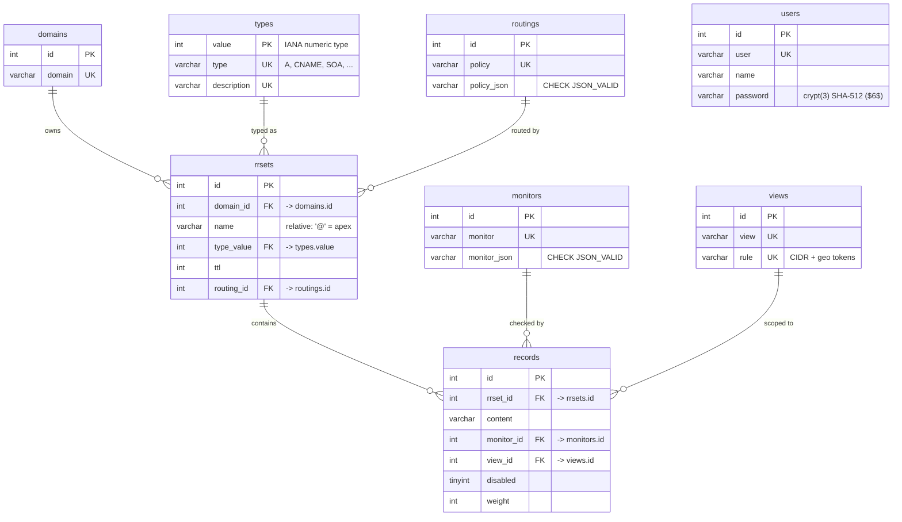

# PowerGSLB Database

This directory holds the database definition for PowerGSLB:

- `scheme.sql` - tables, constraints, the `rrset_guard` procedure, and the triggers that enforce DNS invariants.
- `data.sql` - seed data: the default `admin` user, three views, the DNS type catalog, seven example monitors,
  three routing policies, and three fully populated example zones.

The schema targets MySQL 8 / MariaDB 10.5+ (CHECK constraints and `SIGNAL` in triggers are required). In the
all-in-one Docker image both files are copied to the image and loaded into MariaDB on first boot.

## Contents

- [Why a relational schema](#why-a-relational-schema)
- [Entity-relationship diagram](#entity-relationship-diagram)
- [Table reference](#table-reference)
- [The two-level rrset / record model](#the-two-level-rrset--record-model)
- [Invariants and where they live](#invariants-and-where-they-live)
- [Why triggers (DB logic vs. app logic)](#why-triggers-db-logic-vs-app-logic)
- [Read and write paths](#read-and-write-paths)
- [Seed data](#seed-data)
- [Working with the database by hand](#working-with-the-database-by-hand)
- [Recreating](#recreating)

---

## Why a relational schema

PowerGSLB is a PowerDNS Remote Backend: PowerDNS asks it for the records at a name, and PowerGSLB answers from this
database after filtering by view and health and then applying the rrset's routing policy. The data is naturally
relational - many records share a view, a monitor, or a type, and many rrsets share a routing policy - so the schema is
normalised: `views`, `types`, `monitors`, `routings`, and `domains` are lookup tables, and `rrsets` / `records`
reference them by id. This keeps a monitor definition, a routing policy, or a view rule in one place and lets the read
path JOIN the pieces back together per query.

---

## Entity-relationship diagram

Crow's-foot notation: `||` is "exactly one", `o{` is "zero or more". `users` has no foreign keys; it stands alone.



Unique keys not shown as columns: `rrsets (domain_id, name, type_value)` and `records (rrset_id, view_id, content)`.

---

## Table reference

Eight tables.

| Table      | Purpose                                                                                                |
|------------|--------------------------------------------------------------------------------------------------------|
| `users`    | Admin-interface accounts. `password` is a crypt(3) SHA-512 hash (Linux shadow `$6$` format).           |
| `views`    | Named client groups. `rule` is a space-separated list of CIDR and geo tokens matched per query.        |
| `types`    | DNS record-type catalogue keyed by the numeric type value (`A=1`, `CNAME=5`, `SOA=6`, ...).            |
| `monitors` | Health-check definitions as `monitor_json`; `CHECK (JSON_VALID(...))` keeps the JSON well-formed.      |
| `routings` | Routing-policy definitions as `policy_json`; `CHECK (JSON_VALID(...))` keeps the JSON well-formed.     |
| `domains`  | Authoritative zones, one row per zone apex (`example.com`).                                            |
| `rrsets`   | One `(domain_id, name, type_value)`; owns `ttl` and `routing_id`.                                      |
| `records`  | One answer inside an rrset: `content`, plus `monitor_id`, `view_id`, `disabled`, `weight`.             |

Key relationships and constraints:

- `rrsets.name` is relative to the zone: `'@'` for the apex, otherwise the labels to the left of the zone (`www`,
  `mail1`, `_sip._tcp`). The FQDN is never stored; the read path rebuilds it.
- `rrsets` unique key `(domain_id, name, type_value)` - one rrset per record name and type within a zone.
- `records` unique key `(rrset_id, view_id, content)` - the same content cannot appear twice for one view in an rrset.
- Foreign keys point `rrsets -> domains, types, routings` and `records -> rrsets, monitors, views`. A populated rrset
  cannot be deleted because its records reference it; you delete the records and the rrset is garbage-collected (below).
- CHECK constraints: SOA only at the apex (`type_value <> 6 OR name = '@'`), `ttl <= 2147483647`,
  `JSON_VALID(monitor_json)` on `monitors`, and `JSON_VALID(policy_json)` on `routings`.

---

## The two-level rrset / record model

A DNS RRset (RFC 2181) is the set of records sharing a record name and type; `ttl` and the routing policy are
properties of that set, not of an individual answer. Splitting the data into `rrsets` (the set: name, type, ttl,
routing_id) and `records` (the members: content + GSLB fields) makes per-record TTL divergence unrepresentable rather
than something the application has to validate away. Adding a fourth A record to `www` is one `records` row referencing
the existing rrset; it automatically inherits the rrset's TTL and routing policy.

Because the record name is relative, a record's full name is its `domains.domain` joined with a non-apex `rrsets.name`.
The admin grid shows `Domain` and a relative `Name` for this reason; there is no stored FQDN column to keep in sync.

---

## Invariants and where they live

Some rules cannot be expressed as a column type, a unique key, or a single-row CHECK, because they depend on other
rows in the same or a related table. Those live in the `rrset_guard` procedure and the row triggers in `scheme.sql`:

- **CNAME exclusivity** (both directions): a CNAME rrset cannot coexist with any other rrset at the same name, and a
  non-CNAME rrset cannot be added where a CNAME already exists (`rrset_guard`, called from the `rrsets` BEFORE
  triggers).
- **SOA cardinality**: an SOA rrset holds exactly one record (`rrset_guard` on rrset changes, and the `records` BEFORE
  insert/update triggers when a record is added to an SOA rrset).
- **CNAME single answer per view**: a CNAME rrset allows one record per view (`records` BEFORE insert/update triggers).
- **rrset garbage collection**: when a record's delete or rrset reassignment leaves its old rrset empty, the
  `records` AFTER delete/update triggers remove that rrset, so orphan rrsets never accumulate.

These complement the declarative guarantees (foreign keys, unique keys, single-row CHECKs) that the engine already
enforces.

> **Hard rule for the write path:** a statement that UPDATEs or DELETEs `records` must not also reference `rrsets`
> (e.g. in a subquery). The AFTER trigger fires within that statement and would touch `rrsets`, raising MySQL error
> 1442 ("Can't update table in trigger because it is already used by the statement"). The application threads the
> rrset id through `LAST_INSERT_ID()` instead of a `rrsets` subquery for exactly this reason.

---

## Why triggers (DB logic vs. app logic)

There is always a tradeoff between enforcing a rule in the database and enforcing it in the application. PowerGSLB
pushes the structural DNS invariants down into the database on purpose, because the data is reached through two
independent write paths:

1. **The web admin UI** (`AdminRequestHandler` -> `W2UIMixIn`), used day to day.
2. **Manual SQL**, used for bulk imports, migrations, and operational fixes - including loading `data.sql` itself.

A rule enforced only in the Python layer (path 1) is silently bypassed by path 2. By placing CNAME exclusivity, SOA
cardinality, and rrset GC in triggers and constraints, both paths are covered: a hand-written `INSERT` that would
create two records in an SOA rrset is rejected by the same `SIGNAL` that protects the UI, and the database can never
reach a state the DNS read path is not prepared for.

The cost of this choice is real and worth stating:

- Logic is split between SQL (`scheme.sql`) and Python (the mixins); a maintainer must read both.
- Triggers are harder to unit-test than Python and tie the project to MySQL/MariaDB trigger and CHECK semantics.
- Error reporting is a `SQLSTATE '45000'` message string, which the application surfaces rather than a typed
  exception.

The dividing line used here: invariants that must hold for the data to be valid DNS live in the database
(constraints + triggers); policy and presentation live in the application (health filtering, weighting, view
matching, routing-policy selection, password hashing, w2ui grid shaping). The runtime GSLB decisions are deliberately
*not* in the database - they change per query and depend on live monitor state, so they belong in the read path.

---

## Read and write paths

The Python layer is two mixins on `MySQLDatabase` (`src/powergslb/database/mysql/`):

**Read path** - `PowerDNSMixIn` (`powerdns.py`):

- `gslb_records(qname, qtype)` resolves the owning zone by a longest-suffix match: the candidate parent zones of
  `qname` matched against `domains.domain` with `domain IN (...)` and the longest match wins (most-specific zone).
  It recovers the relative record name with `SUBSTRING` and rebuilds the answer FQDN with `CASE`/`CONCAT`.
  Disabled records are excluded; view/health filtering and the routing policy run in Python.
- `gslb_checks()` returns every record's id, content, and `monitor_json` for the monitor threads.
- `gslb_domains()` returns each zone's apex SOA content for the PowerDNS zone cache.

**Write path** - `W2UIMixIn` (`w2ui.py`) routing to the `Table` classes (`tables.py`):

- `check_user` authenticates an admin request against `users`.
- `get_data` / `save_data` / `delete_data` resolve the w2ui data token against the `TABLES` registry and delegate
  to the table, which owns its SQL; search, sort and paging run in SQL (a `PageRequest`).
- The `status` token's `Status.get` adds the On/Off `CASE` over `disabled` and the down-id snapshot on top of the
  records join.
- `Records.save` writes the rrset and record levels in one transaction: an `INSERT ... ON DUPLICATE KEY UPDATE`
  upserts the rrset and pins its id with `LAST_INSERT_ID(id)`, then the record statement reads that id back from
  `LAST_INSERT_ID()` - honoring the "no `rrsets` reference in a `records` write" rule above.

---

## Seed data

`data.sql` gives a working, self-consistent starting point:

- **Users**: `admin` / `admin` - the default account. The stored hash is crypt(3) SHA-512.
  **Change it before any real deployment** - easiest from the admin UI (edit the `admin` user and set a new
  password) or via `powergslb`'s `hash_password` function, then `UPDATE users`.
- **Views**: `Public` (`0.0.0.0/0 ::/0`), `Private` (RFC 1918 ranges),
  and `Europe` (`country:DE country:FR continent:EU`) as a GeoIP example.
- **Types**: the common DNS types (A, NS, CNAME, SOA, PTR, MX, TXT, AAAA, SRV, SVCB, HTTPS, CAA) keyed by their IANA
  numeric value.
- **Monitors**: `No check` (id 1, the inert default every seed record uses; its JSON is `{"type": "none"}` - the
  registered `none` check type that MonitorManager never threads) plus one example per other check type - `exec`,
  `icmp`, `http`, `tcp`, `tls` - with two `http` examples, one plain HTTP and one HTTPS.
  `${content}` in a monitor's JSON is replaced with the record content at check time, and the shared timing fields
  (`interval`/`timeout`/`fall`/`rise`) may be omitted to take their defaults (`3`/`1`/`3`/`5`).
- **Routings**: `Round robin` (id 1, the default every rrset uses; `{"type": "round-robin"}`), `Weighted random`
  (`{"type": "weighted-random"}`), and `Sticky hash` (`{"type": "sticky-hash"}`). Every seed rrset uses round-robin;
  weighted-random and sticky-hash ship as ready-to-use policies you can point an rrset at.
- **Zones**: `example.com`, `example.net`, `example.org`, each with SOA, NS, A, AAAA, CNAME, MX, SPF, TXT, SRV,
  SVCB, HTTPS, and CAA. All addresses are from the documentation ranges (`192.0.2.0/24`, `2001:db8::/32`) so the seed
  is safe to publish.

The three zones are identical in structure, which makes the seed a useful template. Because record names are stored
relative to the zone, you can adopt a seed zone by renaming it: edit its `Domain` in the admin UI, or run
`UPDATE domains` against the database. Note that PowerDNS refreshes domains every 5 minutes by default.

---

## Working with the database by hand

```bash
# Inside the Docker image (MariaDB is local):
mariadb powergslb

# A point query the way the backend resolves a name:
SELECT r.content, t.type, rs.ttl
FROM records r
  JOIN rrsets rs ON r.rrset_id = rs.id
  JOIN types  t  ON rs.type_value = t.value
  JOIN domains d ON rs.domain_id = d.id
WHERE d.domain = 'example.com' AND rs.name = '@' AND t.type = 'A';
```

When inserting by hand, insert the rrset first, then its records (the FK requires the rrset to exist). To remove a
record, `DELETE FROM records WHERE ...`; the AFTER-delete trigger drops the rrset once its last record is gone, so do
not delete the rrset yourself. The trigger invariants apply to manual SQL exactly as they do to the UI - an `INSERT`
that violates CNAME exclusivity or SOA cardinality fails with the `SIGNAL` message.

---

## Recreating

To start fresh:

```bash
mariadb -e "DROP DATABASE IF EXISTS powergslb; CREATE DATABASE powergslb CHARACTER SET utf8mb4;"
mariadb powergslb < database/scheme.sql
mariadb powergslb < database/data.sql   # optional: seed/example data
```
